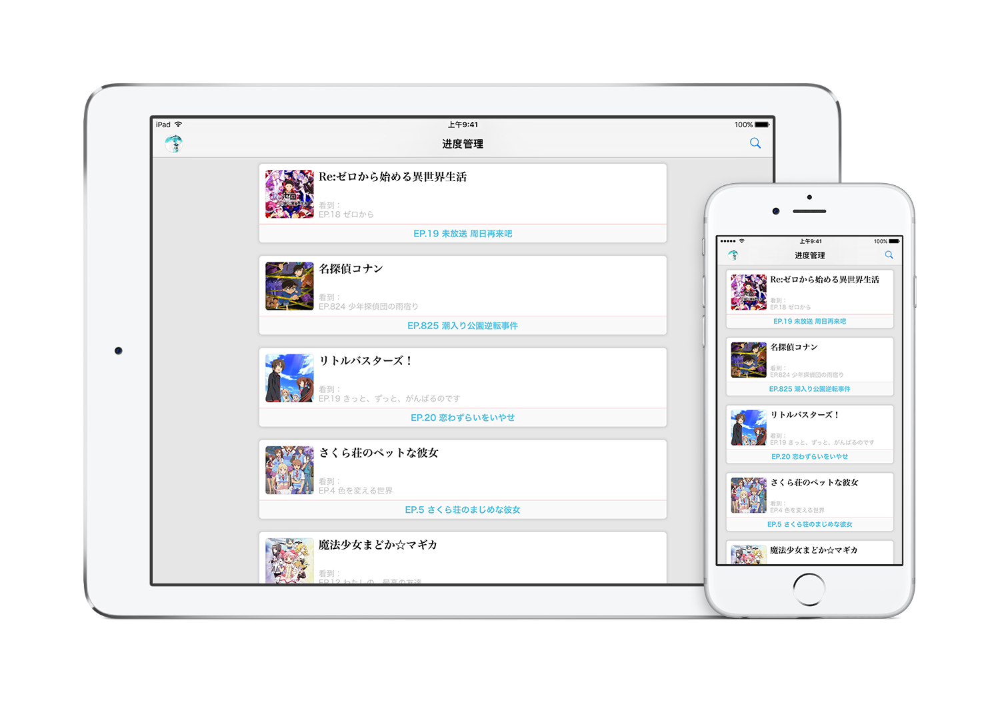

# Bangumi M

The third-party iOS application of [番组计划](http://bgm.tv).

### App Store

## Acknowledgements
- [Alamofire](https://github.com/Alamofire/Alamofire)
- [AlamofireImage](https://github.com/Alamofire/AlamofireImage)
- [Canvas](https://github.com/CanvasPod/Canvas)
- [Cosmos](https://github.com/exchangegroup/Cosmos)
- [HKKTagWriteView](https://github.com/fullc0de/HKKTagWriteView)
- [Kanna](https://github.com/tid-kijyun/Kanna)
- [KeychainAccess](https://github.com/kishikawakatsumi/KeychainAccess)
- [MGSwipeTableCell](https://github.com/MortimerGoro/MGSwipeTableCell)
- [MJRefresh](https://github.com/CoderMJLee/MJRefresh)
- [SVProgressHUD](https://github.com/SVProgressHUD/SVProgressHUD)
- [SwiftyJSON](https://github.com/SwiftyJSON/SwiftyJSON)
- [UITextField+Shake](https://github.com/andreamazz/UITextField-Shake)

## License
Bangumi M is released under the [MIT License](./LICENSE).

*(BangumiAPI.swift is not included. Please contact me to request the API if you want to contribute code.)*

## 🍩🍩🍩🍩🍩
> どんどんドーナツ，どーんと行こう！